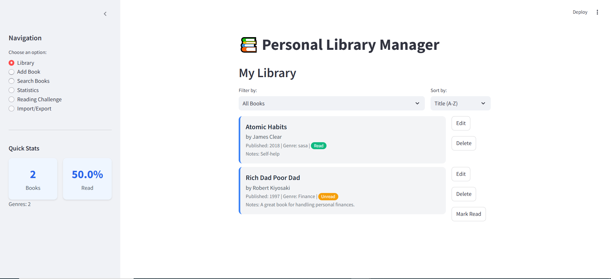

# Personal Library Manager

  
*A sleek and interactive web application to manage your personal book collection.*

---

## Live Demo

🚀 **Try it out here:** [Live Demo]([https://your-live-demo-url.com](https://library-manager-h.streamlit.app/))

---

## Overview

**Personal Library Manager** is a Streamlit-based web application designed to help book enthusiasts organize, track, and analyze their reading habits. Whether you're cataloging your bookshelf, setting reading goals, or exploring statistics about your collection, this app provides a user-friendly interface with interactive visualizations powered by Plotly and data handling via Pandas.

Built with Python, this project showcases a modern approach to personal library management with features like book tracking, search functionality, and export/import capabilities.

---

## Features

- **Library Management**: Add, edit, delete, and mark books as read/unread.
- **Search Functionality**: Search books by title, author, genre, year, or advanced criteria.
- **Statistics Dashboard**: Visualize your collection with interactive charts (genre distribution, read vs. unread, publication years, top-rated books).
- **Reading Challenge**: Set annual reading goals and track progress with a dynamic gauge and timeline.
- **Import/Export**: Backup your library as a JSON file or import an existing collection.
- **Responsive Design**: Custom CSS for a clean, modern UI with book cards and stat widgets.

---

## Tech Stack

- **Python 3.9+**: Core programming language.
- **Streamlit**: Web app framework for the UI.
- **Pandas**: Data manipulation and analysis.
- **Plotly**: Interactive data visualizations.
- **JSON**: Persistent storage for the library data.

---

## Installation

To run this project locally, follow these steps:

### Prerequisites
- Python 3.9 or higher
- Git (optional, for cloning the repo)
- A package manager (e.g., `pip` or `uv`)

### Steps

1. **Clone the Repository**:
   ```bash
   git clone https://github.com/your-username/personal-library-manager.git
   cd personal-library-manager
   ```

2. **Set Up a Virtual Environment (optional but recommended)**:
   ```bash
   python -m venv .venv
   source .venv/bin/activate  # On Windows: .venv\Scripts\activate
   ```

3. **Install Dependencies**:
   
   Using pip:
   ```bash
   pip install -r requirements.txt
   ```
   
   Or using uv (faster alternative):
   ```bash
   uv pip install -r requirements.txt
   ```
   
   **Note:** If you use `uv` and prefer managing dependencies via `pyproject.toml`, run `uv sync` after cloning (if included).

4. **Run the App**:
   ```bash
   streamlit run main.py
   ```
   
   The app will open in your default browser at [http://localhost:8501](http://localhost:8501).
